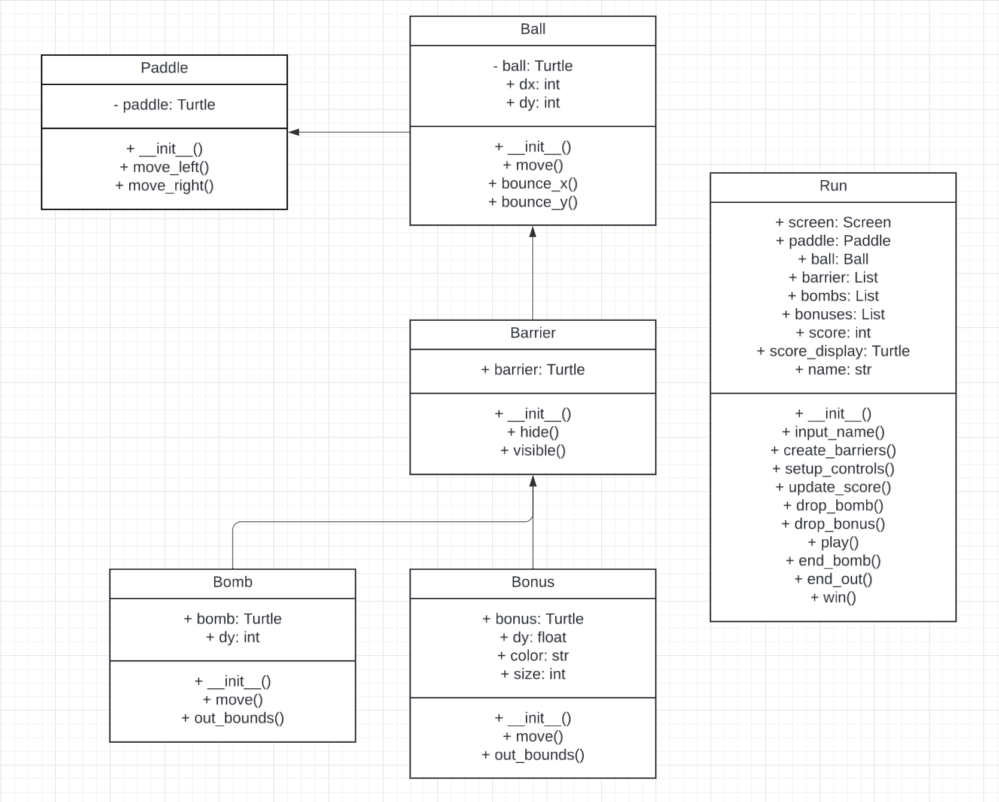

BOMB Bouncing Game
BOMB Bouncing : The game controlling a paddle to bounce a ball, destroy barriers, avoid bombs, 
                and collect bonuses that increase your score.

# Game Components
- Paddle: Controlled by the player using the arrow keys. The paddle is used to bounce the ball back into play.
- Ball: The ball bounces around the screen, and the player must keep it from falling below the paddle.
- Barrier: Obstacles that the ball can destroy. When destroyed, barriers may release bombs or bonuses.
- Bomb: If the ball collides with a bomb, the game ends.
- Bonus: Collecting a bonus adds extra points to the player's score.

# Usage
1. The player enters their name.
2. The player controls a paddle using the left and right arrow keys.
3. The ball bounces around the screen and can destroy barriers.
4. When a barrier is destroyed, there is a 30% chance of dropping a bomb and a bonus.
5. If the ball falls below the paddle, the game ends.
6. If the player successfully destroys all barriers, they win the game.

# Sample usage
https://youtu.be/46AU6_g-ZU8

# Class
1. Paddle
   - Represents the paddle controlled by the player.
     - move_left(): Moves the paddle to the left.
     - move_right(): Moves the paddle to the right.

2. Ball
   - Represents the ball that bounces around the screen.
     - move(): Moves the ball based on its velocity.
     - bounce_x(): Reverses the ball's direction along the x-axis.
     - bounce_y(): Reverses the ball's direction along the y-axis.

3. Barrier
   - Represents the barriers the ball can collide with and destroy.
     - hide(): Hides the barrier when it is destroyed.
     - visible(): Returns whether the barrier is visible.

4. Bomb
   - Represents a bomb that may be dropped when a barrier is destroyed.
     - move(): Moves the bomb down the screen.
     - out_bounds(): Checks if the bomb has fallen out of the screen.

5. Bonus
   - Represents a bonus item that adds points to the player's score.
     - move(): Moves the bonus item down the screen.
     - out_bounds(): Checks if the bonus has fallen out of the screen.

6. Run
   - Controls the overall game flow and interactions between all objects.
     - input_name(): Prompts the player for their name.
     - create_barriers(): Generates the initial barriers on the screen.
     - update_score(): Updates the score display.
     - play(): Main game loop where collisions and game logic are handled.
     - win(): Displays a message when the player wins the game.
     - end_bomb(): Ends the game if a bomb collides with the paddle.
     - end_out(): Ends the game if the ball falls below the paddle.

# UML Class Diagram
picture: 

https://lucid.app/lucidchart/f79ebc20-3cef-40e2-9b71-928daae31660/edit?viewport_loc=-431%2C-139%2C2961%2C1597%2CHWEp-vi-RSFO&invitationId=inv_9c2d6aa0-1eb0-4682-bed6-c01fd85609de

+---------------------+             +---------------------+
|       Paddle        | <---------- |        Ball         |
+---------------------+             +---------------------+
| + paddle: Turtle    |             | + ball: Turtle      |
+---------------------+             | + dx: int           |
| + __init__()        |             | + dy: int           |
| + move_left()       |             +---------------------+
| + move_right()      |             | + __init__()        |
+---------------------+             | + move()            |
                                    | + bounce_x()        |
                                    | + bounce_y()        |
                                    +---------------------+
                                           ^
                                           |
                                           |
                                           |
                                  +---------------------+
                                  |      Barrier        |
                                  +---------------------+
                                  | + barrier: Turtle   |
                                  +---------------------+
                                  | + __init__()        |
                                  | + hide()            |
                                  | + visible()         |
                                  +---------------------+
                                           ^
                                           |
                             +-------------+------------------+
                             |                                |
                    +---------------------+            +---------------------+
                    |        Bomb         |            |        Bonus        |
                    +---------------------+            +---------------------+
                    | + bomb: Turtle      |            | + bonus: Turtle     |
                    | + dy: int           |            | + dy: float         |
                    +---------------------+            | + color: str        |
                    | + __init__()        |            | + size: int         |
                    | + move()            |            +---------------------+
                    | + out_bounds()      |            | + __init__()        |
                    +---------------------+            | + move()            |
                                                       | + out_bounds()      |
                                                       +---------------------+

+---------------------+
|         Run         |
+---------------------+
| + screen: Screen    |
| + paddle: Paddle    |
| + ball: Ball        |
| + barriers: List    |
| + bombs: List       |
| + bonuses: List     |
| + score: int        |
| + score_display:    |
|    Turtle           |
| + name: str         |
+---------------------+
| + __init__()        |
| + input_name()      |
| + create_barriers() |
| + setup_controls()  |
| + update_score()    |
| + drop_bomb()       |
| + drop_bonus()      |
| + play()            |
| + end_bomb()        |
| + end_out()         |
| + win()             |
+---------------------+

# Installation
1. Make sure you have Python installed on your system (You can download from : https://www.python.org/downloads/).
2. Install the turtle module if not already installed (usually pre-installed with Python).
3. Clone the repository : https://github.com/Natcha-limsuwan/Final_project.git
4. Run the Bomb_Bouncing.py file to start the game.

# Testing
Run all code and play the game to ensure they work as expected.

# Bugs
Ball speed instability: The ball's speed may occasionally vary unexpectedly, causing the gameplay to feel less smooth
                        (but I'm not sure it is because my laptop or code ).
Ball can pass the paddle: Sometimes the ball may pass through the edge of the paddle, 
                          especially when the paddle is near the edge.
